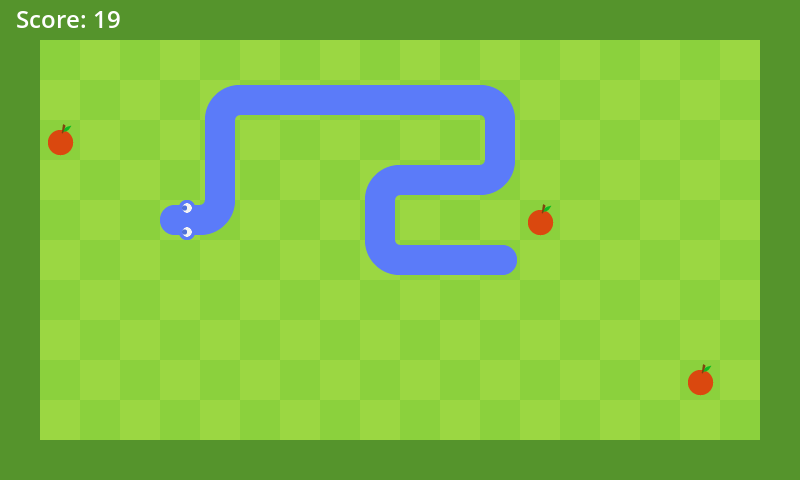

## About
This is a clone of the classical snake game made with C++ and SDL2.
Control the snake to eat apples and grow, but avoid hitting the walls or yourself!



---

## Controls
**Arrow keys:** Move the snake.
**P key:** Pause the game.

---

## Prerequisites
The following tools are required:
- **CMake** 3.15 or higher
- **Compiler** with support to C++17
- **SDL2** library
- **SDL2_image** library
- **SDL2_ttf** library

---

## Build Instructions
For **Windows** systems, you can download the precompiled binaries [here](releases/tag/v1.0.0).

Clone the repository:
```sh
git clone https://github.com/mZake/SnakeGame.git
cd SnakeGame
```

Create a build directory and compile the project:
```sh
mkdir build
cd build
cmake ..
cmake --build .
```

The compiled binary will be generated in the project root directory.

---

## Note
Make sure the `assets` folder is located in the same directory as the compiled binary!
